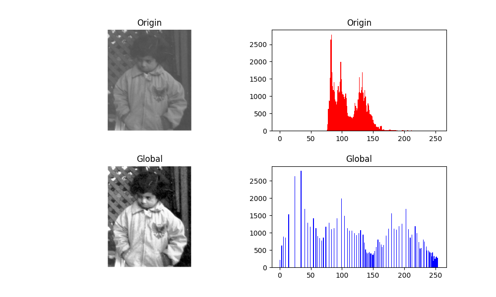
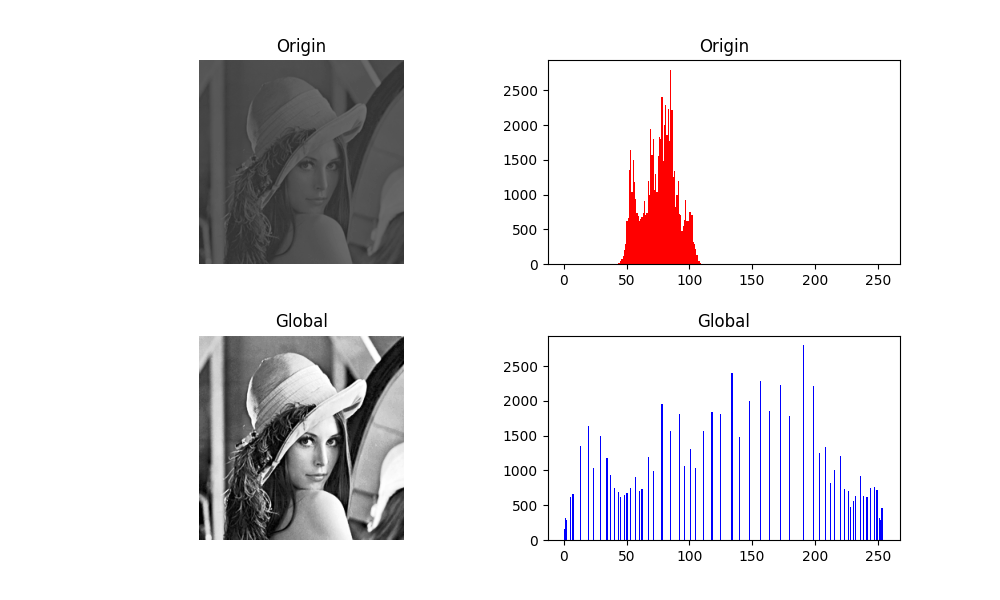
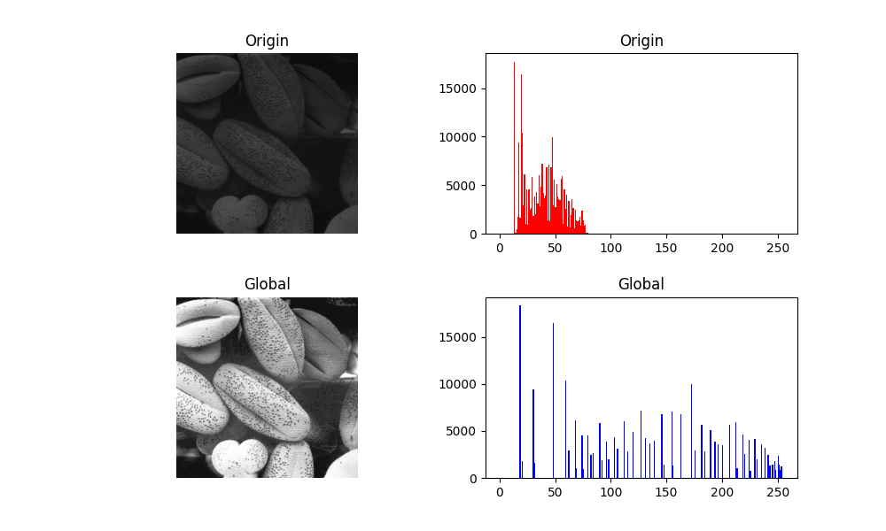
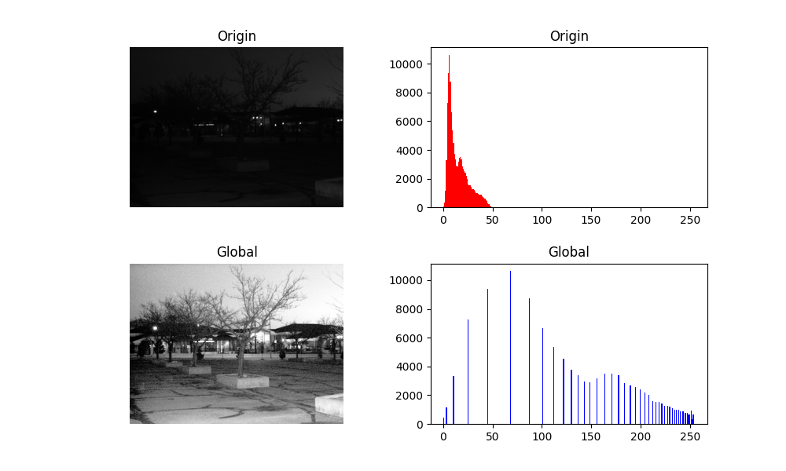

# Histogram Equalization #

Implement histogram equalization.

- Language : python, c++
- Libraries : 
    - matplotlib : read pictures, display pictures and histograms
    - numpy : data processing
    - pybind11 : wrap c++ function
- Result
    - Child 
         
    - Lena 
         
    - Stone 
         
    - University 
        
        