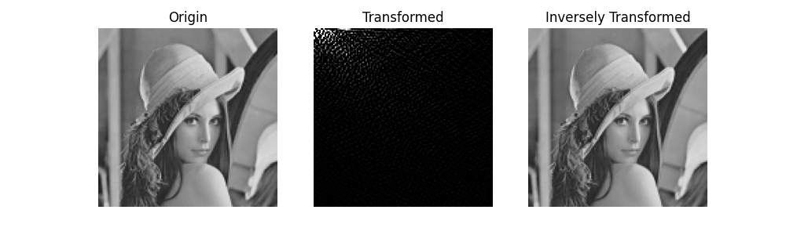
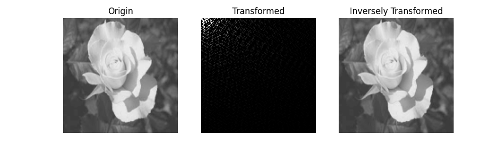
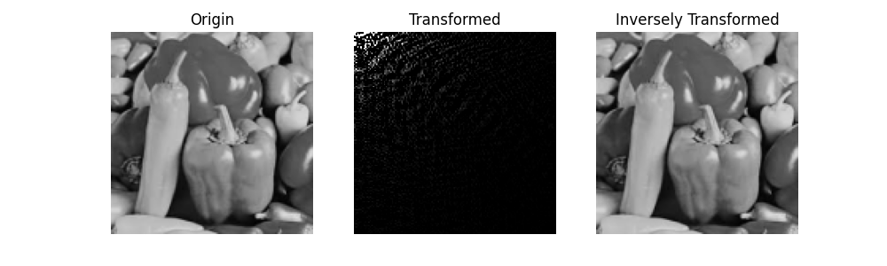
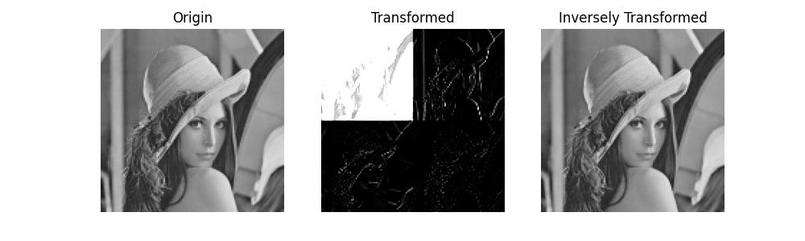
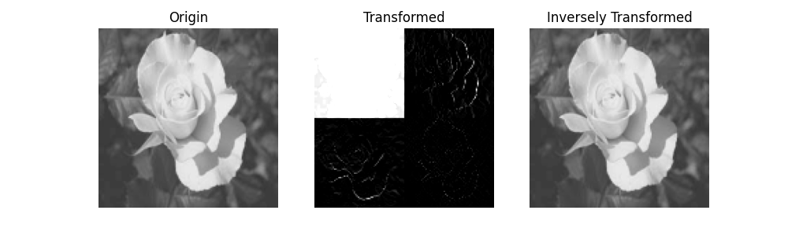
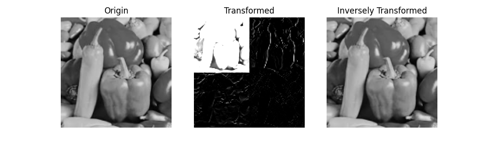

# VQ, DCT, and Wavelet #

Implement DCT, fast DCT, DWT (No VQ), and their inverse functions.

## Infos ##
- Language : python, c++
- Libraries : 
    - matplotlib : read pictures, display pictures and histograms
    - numpy : data processing
    - pybind11 : wrap c++ function

## Result ##
- DCT & IDCT
    - Lena 
         
    - Flower 
         
    - Vegetables 
        
- DWT & IDWT
    - Lena 
         
    - FLower 
         
    - Vegetables 
        

## Execution Time Comparison ##
Execution time(ms) 
lena64.bmp, lena.bmp, lena256.bmp
<table>
    <thead>
        <tr>
            <th>Size</th>
            <th>DCT</th>
            <th>Fast DCT</th>
            <th>SpeedUp</th>
        <tr>
    </thead>
    <tbody>
        <tr>
            <td>64x64</td>
            <td>275</td>
            <td>7</td>
            <td>39.29</td>
        <tr>
        <tr>
            <td>128x128</td>
            <td>2344</td>
            <td>48</td>
            <td>48.83</td>
        <tr>
        <tr>
            <td>256x256</td>
            <td>40867</td>
            <td>523</td>
            <td>78.14</td>
        <tr>
    </tbody>
</table>

## Notes ##
- **DCT** has a great feature of **energy concentration**. Frequency information will be concentrated on the low-frequency part (top-left corner of the spectrum).

- A very famous application of DCT is **JPEG**, which uses DCT to do the **lossy compression**. The information of low-frequency part dominates the vision of human eyes, so if we delete the high-frequency information, the loss will be very small, but can reduce the data size significantly.

- According to the experiment result, these two DCT algorithms have significant difference in the speed : **the fast DCT is 40~70 times faster than the normal DCT**. In normal DCT, each point should take cosine value of each location, so the complexity is **O(n^4)**. However, the fast DCT only does matrix multiplication for twice, which is **O(n^3)**. So, we can predict that fast DCT will be much faster than the normal DCT. When we want to deal with an image in large size, we had better to use fast DCT.

- The **WT** also has a great feature of **energy concentration**. I think the biggest advantage of WT is speed. Its complexity is **O(n^2), even better than fast DCT**. Moreover, it basically **only needs +/- to complete the calculation without complex math**, which can reduce execution time a lot.